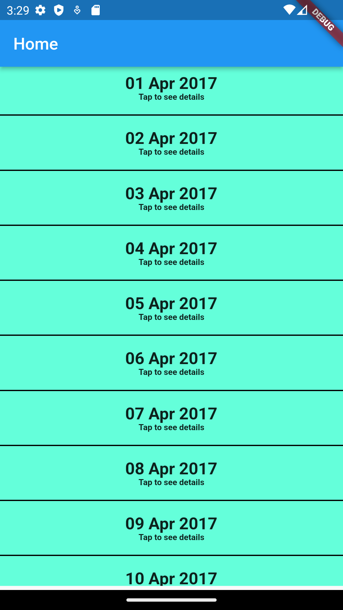
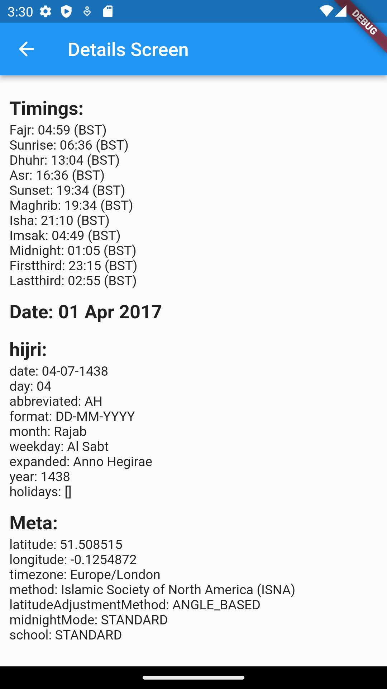
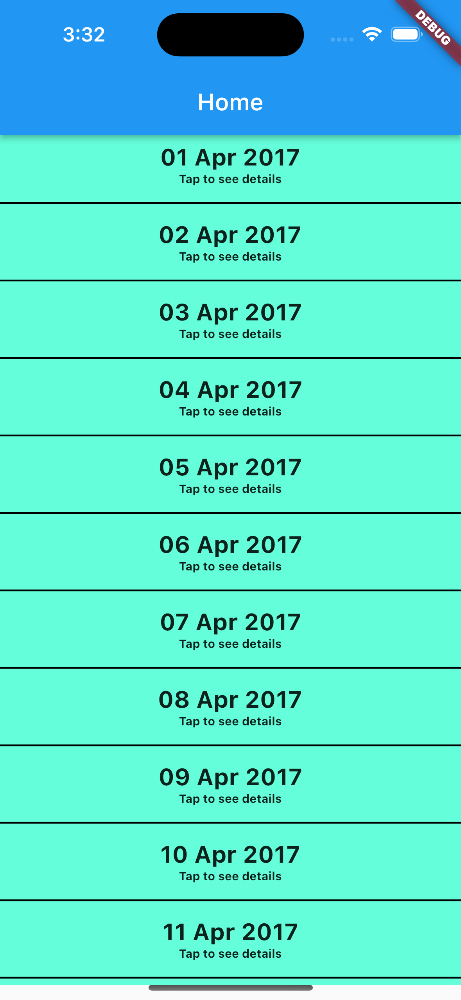
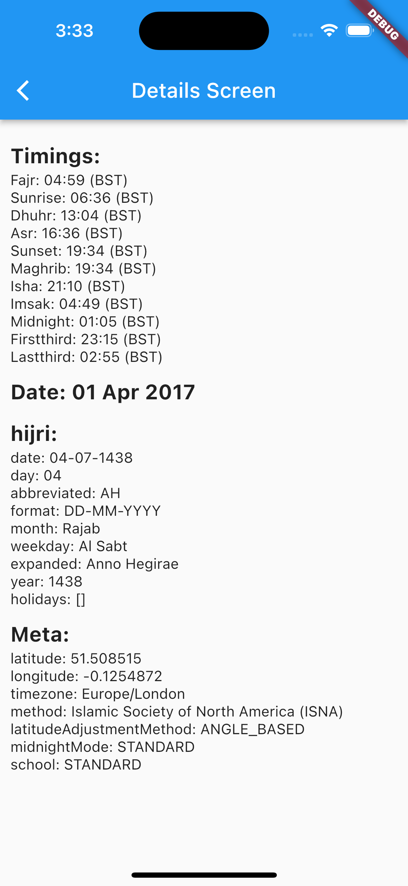

# Flutter App with Basic API using MVC Pattern

This repository contains a Flutter application that interacts with a basic API following the MVC (Model-View-Controller) pattern. Additionally, it is integrated with GitHub Actions for continuous integration and deployment. This README file provides instructions on setting up the project, understanding its structure, and utilizing GitHub Actions.

## Screenshots
### Android

  


### IOS
 


## Getting Started

To get started with this Flutter app, follow these steps:

1. **Clone the Repository:**
   Clone this repository to your local machine using the following command:

   ```git clone https://github.com/radeekhan/flutter_app_basic_api.git```


2. **Navigate to the Project Directory:**
   Move into the project directory:

   ```cd flutter-basic-api-mvc```


3. **Install Dependencies:**
   Use Flutter's package manager, pub, to install dependencies:

   ```flutter pub get```


4. **Run the Application:**
   Run the Flutter app on your preferred device (emulator or physical device):

   ```flutter run```

## Basic API Integration

The Flutter app integrates with a basic API to fetch and display data.

## GitHub Actions

This project is configured with GitHub Actions to automate the testing and deployment process. The workflow is defined in the `.github/workflows` directory.

The workflow file `main.yml` contains the following jobs:

## License

This project is licensed under the MIT License. See the [LICENSE](MIT-LICENSE.txt) file for details.
